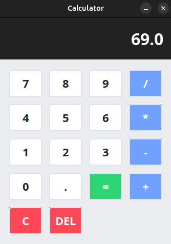

# Java Swing Calculator

This repository contains a simple calculator application built using Java Swing. The project was created for educational purposes, to practice and explore the basics of building graphical user interfaces (GUIs) with Swing in Java.

The calculator supports the four basic arithmetic operations and demonstrates a clear separation between the logic and the user interface. It is not intended for production use, but as a learning exercise for those interested in Java desktop development.

  <h2>Preview</h2>
  

